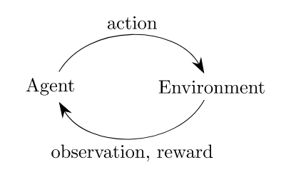

# Getting Started with Gym

Gym是一个开发和比较强化学习算法的工具包**toolkit**。它对**agent**的结构没有任何假设，并且与任何数值计算库**numerical computation library**(如TensorFlow或Theano)兼容。

[gym](https://github.com/openai/gym) library是一个测试问题的集合-环境**environments**-你可以用来制定你的强化学习算法。这些环境有一个允许您编写通用算法的共享接口**a shared interface**。

## Installation

首先，您需要安装Python 3.5+。简单地使用`pip`来安装`gym`：

```bash
pip install gym
```

可以开始了！

## Building from Source

如果您愿意，还可以直接克隆`gym` Git repository。当您正在修改健身房本身或添加环境时，这尤其有用。下载和安装使用：

```bash
git clone https://github.com/openai/gym
cd gym
pip install -e .
```


您可以稍后运行`pip install -e .[all]`来执行包含所有环境的完整安装[full installation](https://github.com/openai/gym#installing-everything)。这需要安装更多相关的依赖项，包括`cmake`和最新的`pip`版本。

# 环境


下面是一个让东西运动起来的很简单的示例**a bare minimum example**。这将运行一个`CartPole-v0`环境的实例，执行1000个时间步长**timesteps**，在每个步骤中呈现环境**rendering the environment**。你应该会看到一个呈现经典的小车-滑杆[cart-pole](https://www.youtube.com/watch?v=J7E6_my3CHk)问题的窗口弹出来：

```python
import gym
env = gym.make('CartPole-v0')
env.reset()
for _ in range(1000):
    env.render()
    env.step(env.action_space.sample()) # take a random action
env.close()
```

它应该是这样的：


通常情况下，我们会在小车-滑杆**cart-pole**离开屏幕之前结束模拟。稍后会详细介绍。现在，请忽略关于调用`step()`的警告，即使这个环境已经返回`done = True`。


如果您希望在行动中看到其他一些环境，请尝试使用类似`MountainCar-v0`、`MsPacman-v0`(需要Atari依赖项[Atari dependency](https://github.com/openai/gym#atari))或`Hopper-v1`(需要MuJoCo依赖项[MuJoCo](https://github.com/openai/gym#mujoco)dependencies)来替换上面的`CartPole-v0`。环境都从`Env`基类**base class**中继承的。


注意，如果您丢失了任何依赖项**dependencies**，应该会得到一条有用的错误消息，来告诉您丢失了什么。(如果依赖项给您带来麻烦而没有明确地提出修复指示，请告诉我们[Let us know](https://github.com/openai/gym/issues)。)安装[Installing](https://github.com/openai/gym#environment-specific-installation)一个缺少的依赖项通常非常简单。您还需要一个用于`Hopper-v1`的MuJoCo许可证[MuJoCo license](https://www.roboti.us/license.html)。

# Observations


如果我们想在每一步都做得比随机行动更好，那么最好知道我们的行动对环境造成了什么影响。


环境的`step`函数返回的正是我们需要的。实际上，`step`返回四个值。这些是:

- `observation`**(object)**：表示您对环境的观察的特定于环境的对象**an environment-specific object**。例如，来自摄像机的像素数据，机器人的关节角度和关节速度**joint angles and joint velocities**，或者棋盘游戏中的棋盘状态**board state**。
- `reward`**(float)**：前一个动作所获得的奖励数量。规模**scale**因环境而异，但目标总是增加你的总回报。
- `done`**(boolean)**：是不是时候再次`reset`环境。大多数(但不是所有)任务都被划分成定义良好的事件**well-defined episodes**，如果`done`为`True`，则表明该事件已经结束。(例如，可能是杆子倾斜得太远了**the pole tipped too far**，或者是你失去了最后的生命。)
- `info`**(dict)**：对调试有用的诊断信息**diagnostic information useful for debugging**。它有时对学习很有用(例如，它可能包含环境最后一次状态更改的原始概率)。但是，您的**agent**的官方评估**official evaluations**是不允许使用这个信息来学习的。

这只是经典的“代理-环境循环”**“agent-environment loop”**的一个实现。每个时间步，**agent**选择一个`action`，环境返回一个`observation`和一个`reward`。




进程**process**通过调用`reset()`启动，该函数返回一个初始`observation`。因此，编写前面代码的更合适的方法是利用**respect**`done`标志:

```python
import gym
env = gym.make('CartPole-v0')
for i_episode in range(20):
    observation = env.reset()
    for t in range(100):
        env.render()
        print(observation)
        action = env.action_space.sample()
        observation, reward, done, info = env.step(action)
        if done:
            print("Episode finished after {} timesteps".format(t+1))
            break
env.close()
```
这应该会给出一个视频和如下输出。您应该能够看到重置**resets**发生在何处。


```bash
[-0.061586   -0.75893141  0.05793238  1.15547541]
[-0.07676463 -0.95475889  0.08104189  1.46574644]
[-0.0958598  -1.15077434  0.11035682  1.78260485]
[-0.11887529 -0.95705275  0.14600892  1.5261692 ]
[-0.13801635 -0.7639636   0.1765323   1.28239155]
[-0.15329562 -0.57147373  0.20218013  1.04977545]
Episode finished after 14 timesteps
[-0.02786724  0.00361763 -0.03938967 -0.01611184]
[-0.02779488 -0.19091794 -0.03971191  0.26388759]
[-0.03161324  0.00474768 -0.03443415 -0.04105167]
```

# Spaces


在上面的例子中，我们一直在从环境的动作空间中随机抽取动作。但这些行为究竟是什么呢?每个环境都有一个`action_space`和一个`observation_space`。这些属性属于`Space`类型，它们描述了有效操作和观察的格式:

```python
import gym
env = gym.make('CartPole-v0')
print(env.action_space)
#> Discrete(2)
print(env.observation_space)
#> Box(4,)
```

`Discrete`空间**space**允许一个固定的非负的范围**a fixed range of non-negative numbers**，所以在这种情况下有效的`action`不是0就是1。`Box`空间**space**表示一个`n`维的box，因此有效的`observations`将是一个由4个数字组成的数组。我们也可以查看`Box`的边界：

```python
print(env.observation_space.high)
#> array([ 2.4       ,         inf,  0.20943951,         inf])
print(env.observation_space.low)
#> array([-2.4       ,        -inf, -0.20943951,        -inf])
```


这种自省**introspection**有助于编写适用于许多不同环境的通用代码。`Box`和 `Discrete`空间是最常见的`Space`。你可以从一个`Space`取样，或者检查某个东西是否属于它:

```python
from gym import spaces
space = spaces.Discrete(8) # Set with 8 elements {0, 1, 2, ..., 7}
x = space.sample()
assert space.contains(x)
assert space.n == 8
```


对于`CartPole-v0`，其中一个动作对左边施加了力，另一个动作对右边施加了力。(你能分辨出哪个是哪个吗?)


幸运的是，你的学习算法越好，你就越不需要自己去解释这些数字。

# Available Environments

**Gym**提供了一系列不同的环境，从简单到困难，涉及许多不同类型的数据。查看完整的环境列表[full list of environments](http://gym.openai.com/envs)以获得鸟瞰图**the birds-eye view**。

- [Classic control](https://gym.openai.com/envs#classic_control)和 [toy text](https://gym.openai.com/envs#toy_text)：完成小规模任务**complete small-scale tasks**，大部分来自RL文献。他们是来让你起步的。
- [Algorithmic](https://gym.openai.com/envs#algorithmic)：执行计算，如添加多位数字**adding multi-digit numbers**和反转序列**reversing sequences**。有人可能因这些任务对计算机来说很容易而表示反对。挑战在于纯粹从这些例子中学习算法。这些任务有一个很好的特性**nice property**，即通过改变序列长度很容易改变难度。
- [Atari](https://gym.openai.com/envs#atari)：玩经典的**Atari**游戏。我们以一种易于安装[easy-to-install](https://github.com/openai/gym#atari)的形式集成了[Arcade Learning Environment](https://github.com/mgbellemare/Arcade-Learning-Environment)(这对强化学习研究产生了很大的影响)。
- [2D and 3D robots](https://gym.openai.com/envs#mujoco)：在仿真中控制机器人**control a robot in simulation**。这些任务使用MuJoCo[MuJoCo](http://www.mujoco.org/)物理引擎**physics engine**，这是为快速和准确的机器人仿真而设计的。其中包括一些来自UC Berkeley研究人员最近进行的基准测试[benchmark](http://arxiv.org/abs/1604.06778)的环境(他们今年夏天将顺便**incidentally**加入我们[joining us](http://gym.openai.com/blog/team-plus-plus/))。MuJoCo是专业软件，但提供免费试用[free trial](https://www.roboti.us/trybuy.html)的许可证。

# The registry

`gym`的主要目的是提供大量的环境集合，这些环境提供了一个公共接口，并进行了版本控制，以便进行比较。要列出安装中可用的环境，只需询问`gym.env .registry`：

```python
from gym import envs
print(envs.registry.all())
#> [EnvSpec(DoubleDunk-v0), EnvSpec(InvertedDoublePendulum-v0), EnvSpec(BeamRider-v0), EnvSpec(Phoenix-ram-v0), EnvSpec(Asterix-v0), EnvSpec(TimePilot-v0), EnvSpec(Alien-v0), EnvSpec(Robotank-ram-v0), EnvSpec(CartPole-v0), EnvSpec(Berzerk-v0), EnvSpec(Berzerk-ram-v0), EnvSpec(Gopher-ram-v0), ...
```

这将给出`EnvSpec`对象的列表。这些参数定义特定任务的参数，包括要运行的试验数量和最大步骤数量。例如，`EnvSpec(Hopper-v1)`定义了一个环境，其中的目标是让一个2D模拟机器人跳跃;`EnvSpec(Go9x9-v0)`在9x9棋盘上定义了围棋游戏。


这些环境**IDs**被视为不透明的字符串**opaque strings**。为了确保将来的有效比较，环境永远不会以影响性能的方式更改，只会被更新的版本替换。我们现在给每个环境加上一个`v0`后缀，以便将来的替换可以自然地称为`v1`、`v2`等。


将您自己的环境添加到注册表中从而使它们对`gym.make()`可用是非常容易的：只要在载入时[`register()`](https://github.com/openai/gym/blob/master/gym/envs/__init__.py)它们。

# Background: Why Gym? (2016)

强化学习(RL)是机器学习中涉及决策和电机控制**motor control**的子领域。它研究**agent**如何在复杂、不确定的环境中学习如何实现目标。令人兴奋的原因有两个:

- **RL非常普遍，涵盖了所有涉及做出一系列决策的问题**：例如，控制机器人的马达**controlling a robot’s motors**使它能够跑[run](https://gym.openai.com/envs/Humanoid-v0)和跳[jump](https://gym.openai.com/envs/Hopper-v0)，做出定价和库存管理等商业决策，或者玩视频游戏[video games](https://gym.openai.com/envs#atari)和棋盘游戏[board games](https://gym.openai.com/envs#board_game)。RL甚至可以应用于具有顺序或结构化[sequential](http://arxiv.org/abs/1511.06732)[or](http://arxiv.org/abs/0907.0786)[structured](http://arxiv.org/abs/1601.01705)输出的监督学习问题。

- **RL算法已经开始在许多困难的环境中取得良好的效果。**RL有着悠久的历史，但直到最近在深度学习方面取得进展之前，它还需要许多针对特定问题的工程。DeepMind的[Atari results](https://deepmind.com/dqn.html)、[Pieter Abbeel’s](http://gym.openai.com/blog/welcome-pieter-and-shivon)团队的[BRETT](http://news.berkeley.edu/2015/05/21/deep-learning-robot-masters-skills-via-trial-and-error/)和[AlphaGo](https://googleblog.blogspot.com/2016/01/alphago-machine-learning-game-go.html)都使用了深度RL算法，这些算法没有对环境做出太多假设，因此可以应用于其他设置。


然而，RL的研究也受到两个因素的限制：

- **需要更好的基准benchmarks。**在监督学习中，进步是由像ImageNet这样的大型标记数据集驱动的。在RL中，最接近的等价物是大量多样的环境集合。然而，现有的RL环境的开源集合没有足够的多样性，而且它们通常很难设置和使用。
- **缺乏publications使用环境的标准性。**在问题定义上的细微差别**Subtle differences**，例如奖励函数**the reward function**或动作集合**the set of actions**，可以极大地改变任务的难度**drastically alter a task’s difficulty**。这个问题使得重现已发表的研究和比较不同论文的结果变得困难。

**Gym**是对解决这两个问题的一种尝试。